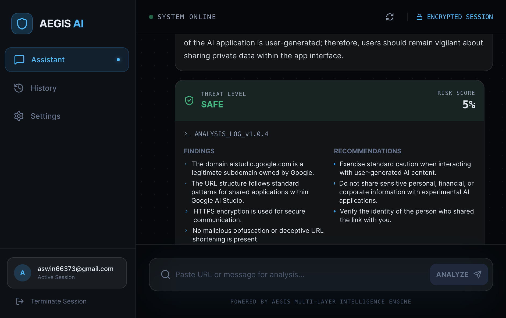

# Aegis AI - Advanced Cybersecurity Threat Analyst

## Problem Statement
In an era of sophisticated digital deception, users are constantly bombarded with phishing attempts, social engineering scams, and malicious links. Traditional filters often miss zero-day threats or subtle psychological manipulation. There is a critical need for an intelligent guardian that can analyze the intent and behavior behind digital communications to protect users before they fall victim to cybercrime.

## Project Description
Aegis AI is an advanced cybersecurity analyst that leverages Google's Gemini AI to provide multi-layered threat detection. It allows users to paste suspicious text, emails, or URLs for immediate analysis. The system evaluates content based on semantic meaning, behavioral patterns (urgency, fear, authority), and URL intelligence, providing a detailed risk score and actionable safety recommendations.

## Google AI Usage
### Tools / Models Used
- **Gemini 3 Flash (`gemini-3-flash-preview`)**: Used for high-speed, accurate content analysis and interactive chat.
- **Google Generative AI SDK (`@google/genai`)**: Integrated for seamless communication between the application and Gemini models.

### How Google AI Was Used
Aegis AI integrates Google AI at its core:
1. **Threat Analysis Engine**: When content is scanned, Gemini performs a deep dive into the text, identifying subtle red flags like "authority manipulation" or "artificial urgency" that traditional regex-based filters miss.
2. **Structured Risk Data**: Using Gemini's JSON response capabilities, the AI provides structured data including risk scores, threat types, and specific findings.
3. **Conversational Intelligence**: The Aegis Assistant uses Gemini to provide context-aware security advice, helping users navigate complex cybersecurity scenarios in natural language.

## Proof of Google AI Usage
Attach screenshots in a `/proof` folder:


## Screenshots 
Add project screenshots:

  


## Demo Video
Upload your demo video to Google Drive and paste the shareable link here (max 3 minutes).
[Watch Demo](#)

## Installation Steps
```bash
# Clone the repository
git clone <your-repo-link>

# Go to project folder
cd aegis-ai

# Install dependencies
npm install

# Run the project
npm start
```

## About
Aegis AI was built to empower everyday users with professional-grade cybersecurity tools. By combining advanced AI reasoning with a user-friendly interface, it bridges the gap between complex threat intelligence and personal digital safety.
